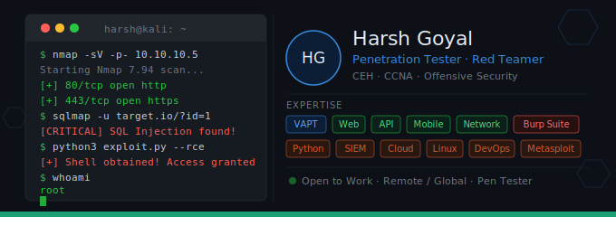

  

<h1 align="center">
  
</h1>

  
  &nbsp;
  
  &nbsp;
  

---

## 🧑‍💻 About Me

I'm a **Penetration Tester and Cybersecurity Engineer** from India with **3+ years of hands-on experience** in Vulnerability Assessment and Penetration Testing (VAPT).

I enjoy breaking things ethically, understanding how attacks work from the inside, and building tools that make the security community's work easier and more efficient.

- 🔐 Specialised in **Web Application, API, Network, and Mobile** pentesting
- 🛠️ Building open-source security tools — currently **VulnDossier**, a full pentest management platform
- 📜 Certified **Ethical Hacker (CEH)** and **CCNA** certified
- 🌱 Currently learning **cloud security** and **advanced exploit development**
- 💬 Ask me about pentesting methodology, report writing, CVSS scoring, or Python automation
- ⚡ Fun fact: I find more bugs in apps I use daily than the companies that built them

---

## 🚀 Featured Project

> **VulnDossier** — An open-source Penetration Test Management Platform. Manage the full lifecycle of a pentest — from request to final report — with a built-in CVSS v3.1 calculator, POC screenshot embedding, PDF + Word report generation, email notifications, and org-wide access control. Built with Python + CustomTkinter.

---

## 🛡️ Skills & Tools

**Offensive Security**

**Development & Automation**

**Certifications**

---

## 📊 GitHub Stats

  
  &nbsp;
  

  

---

## 📬 Let's Connect

I'm always open to talking about pentesting, collaborating on security tools, or just exchanging knowledge with fellow professionals.

- 💼 **LinkedIn:** [harsh-goyal-cybersecurity-engineer](https://www.linkedin.com/in/harsh-goyal-cybersecurity-engineer/)
- 🐙 **GitHub:** [HarshG404](https://github.com/HarshG404)
- 📧 **Open to:** freelance pentesting work, collaborations, and open-source contributions

---

  <i>"The quieter you become, the more you are able to hear." — Kali Linux</i>

